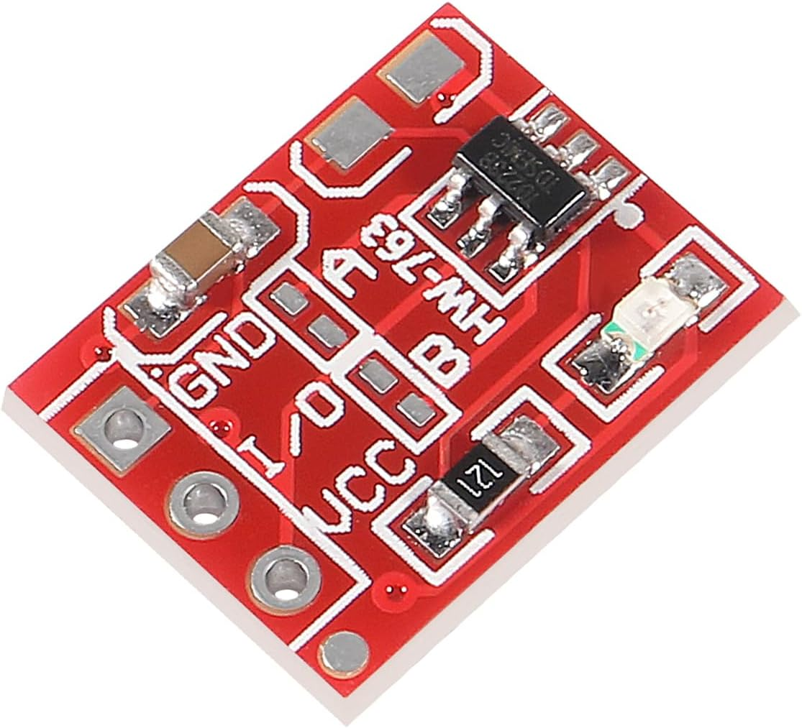
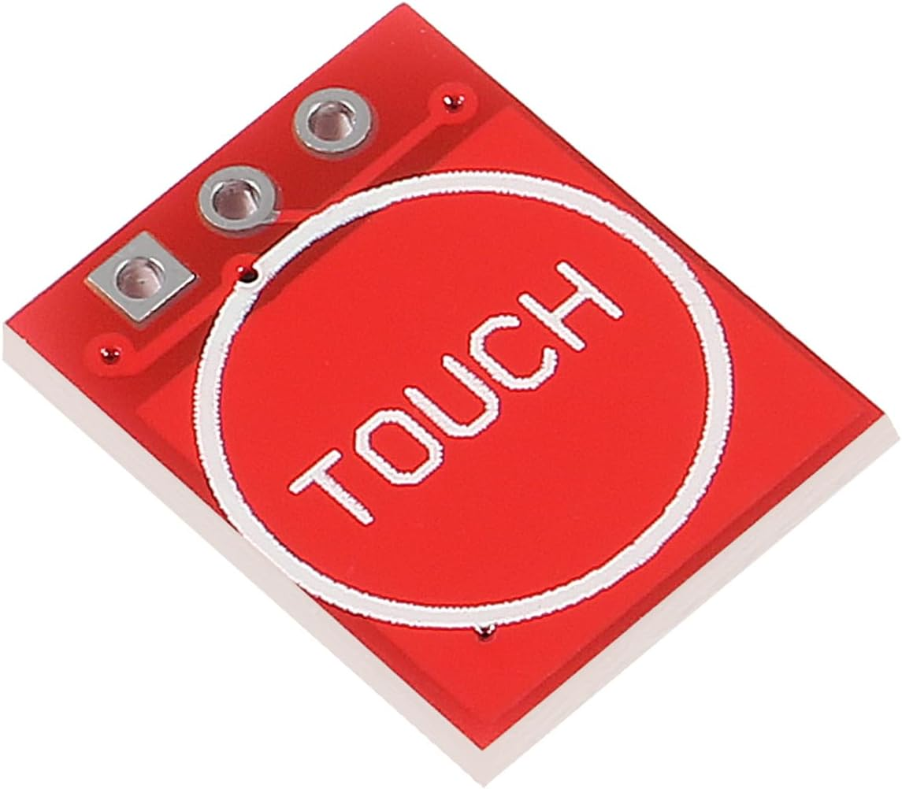

# AnyThink mySummer: Mood Lamp Paintings
This repository for AnyThink [mySummer: Mood Lamp Paintings](https://anythinklibraries.libnet.info/event/13847358)  
project based on [Mood Light That Matches Any Color You Tap on the Art](https://www.instructables.com/Mood-Light-That-Matches-Any-Color-You-Tap-on-the-A/)

## Arduino
Requires [Arduino IDE](https://support.arduino.cc/hc/en-us/articles/360019833020-Download-and-install-Arduino-IDE)
and [FastLED library](https://github.com/FastLED/FastLED)  

The Arduino programming environment, while often referred to as the [Arduino language](https://docs.arduino.cc/language-reference/),
it is essentially [C++](https://isocpp.org/std/the-standard) with a set of pre-defined functions and libraries designed to simplify interaction with the hardware.

## XIAO SAMD21
Uses [XIAO SAMD21](https://wiki.seeedstudio.com/Seeeduino-XIAO/) microcontroller, which features an ARM Cortex-M0+ 32bit 48MHz microcontroller with 256KB Flash and 32KB SRAM  
Board manager URL: https://files.seeedstudio.com/arduino/package_seeeduino_boards_index.json

## TTP223 Touch Sensors
  

## Soldering Information

## Wiring up myMoodlight
  * Connect all TTP223 Touch sensor VCC pins (red) to 3v3 on SAMD21
  * Connect all TTP223 (black) & LED (white) grounds to GND on SAMD21
  * Connect LED strand +5v (red) to 5V on SAMD21
  * Connect LED strand Din (green) to Pin 6 on SAMD21
  * Connect Yellow TTP223 I/O (yellow) to Pin0 on SAMD21
  * Connect Violet TTP223 I/O (yellow) to Pin1 on SAMD21
  * Connect Red TTP223 I/O (yellow) to Pin2 on SAMD21
  * Connect Green TTP223 I/O (yellow) to Pin3 on SAMD21
  * Connect Blue TTP223 I/O (yellow) to Pin4 on SAMD21
  * Connect and route USB cable out of frame
  * Tape down SAMD21 and all TTP223 sensors
