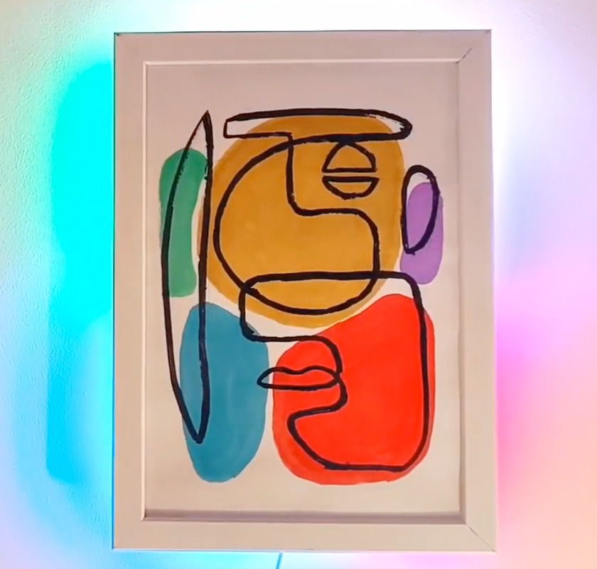

# AnyThink
This repository for AnyThink [mySummer: Mood Lamp Paintings](https://anythinklibraries.libnet.info/event/13847358)  
project based on [Mood Light That Matches Any Color You Tap on the Art](https://www.instructables.com/Mood-Light-That-Matches-Any-Color-You-Tap-on-the-A/)

Requires [Arduino IDE](https://support.arduino.cc/hc/en-us/articles/360019833020-Download-and-install-Arduino-IDE)
and [FastLED library](https://github.com/FastLED/FastLED)

Uses [XIAO SAMD21](https://wiki.seeedstudio.com/Seeeduino-XIAO/) microcontroller  
Board manager URL: https://files.seeedstudio.com/arduino/package_seeeduino_boards_index.json

  

* Wiring up myMoodlight
  * Connect all TTP223 Touch sensor VCC pins to 3v3 on SAMD21
  * Connect all TTP223 & LED grounds to GND on SAMD21
  * Connect LED strand +5v (red) to 5V on SAMD21
  * Connect LED strand Din (green) to Pin 6 on SAMD21
  * Connect Yellow TTP223 to Pin0 on SAMD21
  * Connect Violet TTP223 to Pin1 on SAMD21
  * Connect Red TTP223 to Pin2 on SAMD21
  * Connect Green TTP223 to Pin3 on SAMD21
  * Connect Blue TTP223 to Pin4 on SAMD21
  * Connect and route USB cable out of frame
  * Tape down SAMD21 and all TTP223 sensors
